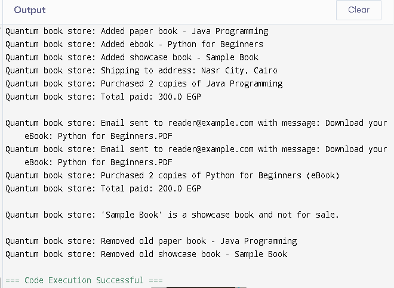

# Quantum Bookstore

Quantum Bookstore is a simple Java console application that simulates an online bookstore.

## What the program does

- Adds paper books, eBooks, and showcase-only books to the inventory
- Allows users to buy paper books (with shipping)
- Sends eBooks via email
- Prevents users from buying showcase books
- Removes books that are too old

## How to run the program

1. Open the project in a Java IDE like IntelliJ IDEA or VS Code.
2. Open the file `QuantumBookstore.java`.
3. Run the `main` method to see the program in action.

## Sample output

Quantum book store: Added paper book - Java Programming  
Quantum book store: Added ebook - Python for Beginners  
Quantum book store: Added showcase book - Sample Book  
Quantum book store: Shipping to address: Nasr City, Cairo  
Quantum book store: Purchased 2 copies of Java Programming  
Quantum book store: Total paid: 300.0 EGP  

Quantum book store: Email sent to reader@example.com with message: Download your eBook: Python for Beginners.PDF  
Quantum book store: Purchased 2 copies of Python for Beginners (eBook)  
Quantum book store: Total paid: 200.0 EGP  

Quantum book store: 'Sample Book' is a showcase book and not for sale.  

Quantum book store: Removed old paper book - Java Programming  
Quantum book store: Removed old showcase book - Sample Book

## Screenshot

This is a real screenshot of the program output:

## Created by

Taghreed Basuny
